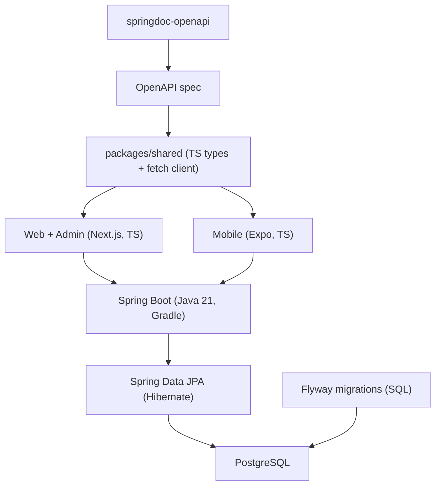

# Sri Lanka Car Rental Platform - Project Plan

A car rental web platform for Sri Lanka, aimed at both tourists and locals. Full platform: a public website, an owner/admin dashboard, and a mobile app.

---

## 1. Goal

Let visitors and locals in Sri Lanka find and book rental cars online, including the popular **rent-with-a-driver** option. Registered car owners / rental agencies list their vehicles and manage bookings. Visitors and renters do **not** need an account — they browse and book as guests.

**MVP features**
- Advertiser accounts (car owners / agencies) + admin; signup has two panels for **Sri Lankan locals** and **Foreigners**
- Browse & search cars with filters (no login required)
- Booking with date ranges + availability (guest booking for renters)
- Rent-with-driver option (priced separately)
- Maps for pickup locations
- Ratings & reviews

**Deferred to later (not in MVP)**
- Online payments (**PayHere**, the main Sri Lankan gateway, for local cards + **Stripe** for foreign cards). Schema reserves a `Payment` entity and a `paymentStatus` field now so it can be wired in later without migration pain.
- Multi-language: English / Sinhala / Tamil
- Potential dual pricing (local vs tourist rates) — supported later by the guest's ID type (NIC vs Passport) captured at booking

---

## 2. Tech Stack

| Layer | Choice |
|---|---|
| Frontend (web + admin) | **Next.js 15** (App Router, TypeScript) + Tailwind CSS + shadcn/ui |
| Backend / API | **Java 21, Spring Boot 3.x** (REST, Gradle build), springdoc-openapi for docs/Swagger UI |
| Security | **Spring Security + JWT** (jjwt) |
| Database | **PostgreSQL** |
| ORM / schema / migrations | **Spring Data JPA + Hibernate**; **Flyway** for migrations (SQL files are the source of truth for schema) |
| Mobile | **Expo** (React Native, TypeScript) |
| Maps | Leaflet + OpenStreetMap (web, free) / react-native-maps (mobile) |
| Monorepo | pnpm workspaces (TS apps) + Gradle (API) |

**Note on schema ownership:** Flyway SQL migrations (`apps/api/src/main/resources/db/migration`) define the schema; JPA entities mirror it and are kept in sync manually (verified by `spring.jpa.hibernate.ddl-auto=validate` in dev). There is no Prisma/`schema.prisma` anymore.

---

## 3. Architecture



---

## 4. Monorepo Layout

```
car-rental/
├─ apps/
│  ├─ web/        # Next.js public site + owner/admin dashboard
│  ├─ api/        # Spring Boot backend (Gradle multi-module, Java 21)
│  │  ├─ src/main/java/com/carrental/
│  │  │  ├─ controllers/   # REST endpoints
│  │  │  ├─ services/      # business logic
│  │  │  ├─ repositories/  # Spring Data JPA repositories
│  │  │  ├─ entities/      # JPA entities
│  │  │  ├─ dto/           # request/response records
│  │  │  └─ security/      # JWT auth + role guards
│  │  └─ src/main/resources/db/migration/   # Flyway V1__init.sql, V2__..., etc.
│  └─ mobile/     # Expo app (renter-facing core flows)
├─ packages/
│  └─ shared/     # TS API types generated from OpenAPI + typed fetch client
├─ gradle/        # Gradle wrapper, build.gradle, settings.gradle
├─ docker-compose.yml   # local Postgres
├─ pnpm-workspace.yaml
└─ README.md
```

---

## 5. Data Model (JPA entities / Flyway SQL)

- **User** (advertisers + admins only) - `id`, `email` (unique), `passwordHash`, `fullName`, `businessName`, `phone`, `role` (`OWNER` | `ADMIN`), `accountType` (`LOCAL` | `FOREIGNER`), `nic` (required for `LOCAL`), `passportNo` + `nationality` (required for `FOREIGNER`), `avatarUrl`, `createdAt`
- **Car** - `id`, `ownerId`, `make`, `model`, `year`, `type` (SEDAN | SUV | VAN | TUK | ...), `transmission`, `seats`, `fuel`, `dailyPrice`, `withDriver`, `driverDailyPrice`, `city`, `lat`, `lng`, `description`, `status` (DRAFT | ACTIVE | HIDDEN)
- **CarImage** - `id`, `carId`, `url`, `sort`
- **Booking** (guest booking — no renter account) - `id`, `carId`, `guestName`, `guestEmail`, `guestPhone`, `guestIdType` (`NIC` | `PASSPORT`), `guestIdNumber`, `startDate`, `endDate`, `withDriver`, `pickupLocation`, `totalPrice`, `status` (PENDING | CONFIRMED | ACTIVE | COMPLETED | CANCELLED), `paymentStatus` (NONE | PENDING | PAID | REFUNDED) — reserved for the future payment gateway
- **Review** - `id`, `bookingId`, `carId`, `reviewerName`, `rating` (1-5), `comment`
- **Payment** (future, not in MVP) - `id`, `bookingId`, `gateway` (`PAYHERE` | `STRIPE`), `amount`, `currency` (LKR/USD), `txReference`, `status`

**Availability rule:** a car is available for `[startDate, endDate]` if no `CONFIRMED`/`ACTIVE` booking overlaps that range. Enforced by an app-level check **plus** a Postgres exclusion constraint (added via a Flyway migration with raw SQL, since Hibernate can't model it natively):

```sql
ALTER TABLE "Booking"
  ADD CONSTRAINT no_overlap
  EXCLUDE USING gist (
    "carId" WITH =,
    daterange("startDate", "endDate") WITH &&
  );
```

---

## 6. Backend (Spring Boot) Design

- `com.carrental.CarRentalApplication` - app entry point, CORS config, OpenAPI metadata (springdoc, `/swagger-ui.html`)
- `config/` - security filter chain, bean wiring, Flyway/JPA properties
- `security/` - JWT (jjwt), password hashing (BCrypt via Spring Security), `@CurrentUser` resolution + role guards (`hasRole("OWNER")`, `hasRole("ADMIN")`)
- **Controllers**
  - `AuthController` - register (owner, local or foreigner panel), login, me
  - `CarController` - list/filter (public), get (public), owner CRUD (auth)
  - `BookingController` - create as guest (with availability check), owner confirm/cancel, list by car
  - `ReviewController` - create on completed booking, list by car
  - `UploadController` - image upload (MultipartFile)
- **Authorization:** guests read/browse cars publicly; owners manage only their own cars/bookings; admins see all. Renters never log in.
- **Image storage:** local `uploads/` in dev; S3-compatible (Cloudinary / Backblaze) in prod.

**Pricing:** `totalPrice = days x (dailyPrice + (withDriver ? driverDailyPrice : 0))`

---

## 7. Key User Flows

1. **Browse & search** (no login): filter by city, price, type, seats, transmission, with-driver; see results on a map
2. **Car detail:** photos, specs, average rating, reviews, map pin, booking widget
3. **Book as guest:** pick dates -> availability check -> toggle driver -> enter contact + ID (NIC for locals / passport for foreigners) -> see price -> confirm (booking = `PENDING`)
4. **Owner signs up** (two-panel registration: Sri Lankan local with NIC, or foreigner with passport + nationality), then **logs in**
5. **Owner confirms** the booking
6. **Trip completes**, guest **leaves a review**
7. **Admin** manages users and listings

---

## 8. Build Phases

1. Scaffold monorepo + `docker-compose` Postgres + Gradle Spring Boot skeleton + env wiring
2. Flyway: `V1__init.sql` full schema (users, cars, images, bookings, reviews) + raw-SQL exclusion constraint migration + seed data (Colombo / Kandy / Galle sample cars + demo owner/admin users)
3. Spring Boot: JPA entities + repositories, security (JWT + BCrypt), auth/cars/bookings/reviews/uploads controllers (verify via `/swagger-ui.html`)
4. Shared types: generate TS types from OpenAPI (`openapi-typescript`) + typed fetch client in `packages/shared`
5. Web auth: two-panel owner registration (local/foreigner) + login + JWT storage + role-based route protection for the dashboard
6. Web public site: home, browse/search + Leaflet map, car detail + reviews
7. Web booking flow (guest): date picker, availability, driver toggle, ID entry, price summary, confirmation
8. Owner/admin dashboard: owner car CRUD + image upload + confirm/cancel; admin user & listing management
9. Reviews: leave/read reviews on completed bookings + aggregate rating on cars
10. Mobile (Expo): browse, car detail, guest booking, my-own-bookings for owners + react-native-maps
11. Deploy: web -> Vercel; API (JAR) + managed Postgres -> Render/Fly/Railway (run Flyway migrations on deploy); configure image storage; write README

---

## 9. Deployment

- **Web:** Vercel
- **API + Postgres:** Render or Fly.io / Railway with a managed Postgres instance; run Flyway migrations on deploy (JAR build via Gradle)
- **Mobile:** Expo dev/preview builds (EAS)
- **Images:** Cloudinary or S3-compatible bucket

---

## 10. How to Verify It Works

- **Public browsing:** a guest can open the site, search, and view cars without any login
- **Availability:** try two overlapping bookings on the same car -> the second is rejected (DB constraint + API pre-check)
- **Authorization:** an owner cannot edit another owner's car (403); only admins see all data
- **Two-panel signup:** a local registers with NIC; a foreigner with passport + nationality; both can only log in after registering
- **End-to-end:** browse -> book with driver as guest -> owner confirms -> complete -> leave review